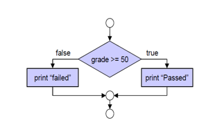
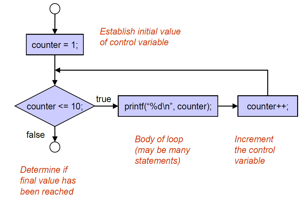
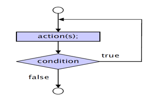
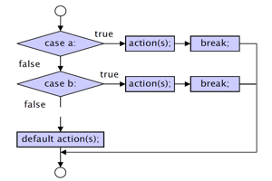
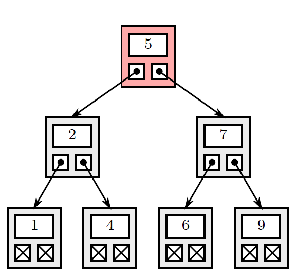

# C Programming Notes


## Imports 

```
#include <stdio.h>
#include <stdlib.h>
```

### stdio.h
* Standard input - output header
* Functions like _printf_,  _scanf_, _fopen_ & _fclose_

### stdlib.h
* standard library header
* Functions like _malloc_, _free_, _rand_

## Escape Sequences
* **\n** -> newline
* **\t** -> tab
* **\\a** -> alert
* **\\** -> insert a backslash
* **\\"** -> insert a quote
* **\r** -> position cursor at the beginning of the line
* **\\?** -> insert ?

## Special characters

```
int sum = 5+6;
printf("The sum is: %d\n", sum);
```

* **%d** -> integers
* **%f** -> for floats
* **%lf** -> for doubles
* **%c** -> for characters
* **%.2f** -> 2 decimal places float
* **%-6s** -> prints a string with left alignment with a minimum field width of 6 (default is right)
* **%6s** -> string with default(right) aligment of minimum field width 6

#### Weird case:

**%8.5f**

* 8 -> Means that there are 8 white spaces assigned for the number
* .5 -> 5 decimal places

This means that if the number is shorter than 8 characters(n characters) the output will include (8-n) whitespaces before printing the number and the number will be printed with 5 decimal places.

However, if the number has more than 8 characters it won't have an an effect on the number and will jsut print to 5 decimal places.

## Arithmetic Operators

* **+** -> Adds
* **-** -> Minus
* **\*** -> Multiplication
* **/** -> Division
* **%** -> Modulus (Remainder after division)

**NB** -> Use brackets when doing more complex operations

```
float sum = (5+6+7)/18;
```

## Memory Concepts

8 bits = 1 byte

* **int** -> 32 bits (4 bytes)
* **float** ->32 bits (4 bytes)
* **double** -> 64 bits (8 bytes)

Hence, doubles can take bigger numbers than floats as it has more memory allocated to store a bigger number.

If your first integer assigned has an adress of 3000, the second would be 3004 (3000 + 4 bytes)

## Scanf

```
scanf(" %c", &integer);
```

**NB** -> When using a character you need a whitespace before.

## The Random Function

```
#include <time.h>

int main(){
    srand(time(NULL));
    int rndValue = (rand()% (upper - lower + 1)) + lower;
    return 0;
}
```

Need to seed the rand function otherwise it won't return a random value

**NB** -> **(rand( ) % (upper - lower + 1)) + lower;**

## Algorithm
Procedure in terms of:
* Actions to be executed
* The order in which the actions are to be executed

## Program Control

* Specifies the order in which these actions are to be executed 
* Control the order using control structures

# Alogirthm Controls

## Pseduocode
* Informal language that helps us develop algorithms
* Similar to everyday english

### How to write pseduocode

1. Always capitalize the first word
2. Only one statment per line
3. Indent to show hierachy, improve readability, and show nested constructs.
4. End multi-line sections using END words (E.g. **END IF**, **END WHILE**)
5. Keep statments programming language independent
6. Keep it simple, consise and readable

E.g. 
```
name = first + last;
```

Say: Append the last name to the first

E.g. 
```
Initialise passes to 0
Initialise failures to 0
Initialise student counter to 1

While student counter is less than or equal to 10
    Input the next exam result
    If the student passed
        Add 1 to passes
    else
        Add 1 to failures
        Add 1 to student counter
    End ifelse
End while

```

## Flow Charts
* Graphical representation of the alogrithm

Start and end point: use an **empty circle**

Symbols:
1. Rectangle -> Indicates any type of action
2. Oval -> Indicates the beginning or end of a program or section of code
3. Diamond -> Indicates the decision is to be made

### If-else flow chart



### For loop flow chart



### do-while flow chart



### Switch case flow chart



### 

## Control Structures

3 Types

1. **Sequence structures**: Executed sequentially by default
2. **Selection structures**: _if_, _if else_ & _switch case_
3. **Repetition structures**: _while_, _for_ & _do while_

## Casting

```
average = (float) average/counter;
```


1. **Implicit conversions**
   * Can lose precision

E.g. 
```
int a = 10;
float b = 5.5;

// Compiler automatically converts 'a' to float
float result = a + b; 
```

2. **Explicit casting**
   * Avoids loss of precision

E.g.
```
int a = 10;
float b = 5.5;

// Explicit casting to avoid loss of precision
float result_explicit = (float)a + b;
```

## Increment and Decrement opperator

* **a++** -> Use the value of a then increment by 1
* **++a** -> Increment by 1 and then use the incremented value 

Same for **a--** and **--a**, just decrement by 1

E.g.

```
    int a = 1;
    printf("a++ = %d\n", a++);
    printf("++a = %d\n", ++a);
```

Output: 
```
a++ = 1
++a = 3
```
E.g. (A1 Question 2)

```
int x = 3;
if(++x == 4){
    printf("x = %d\n", x++);
}
else{
    printf("x = %d\n", --x);
}
printf("now x = %d\n", x);
```

Output: 

```
x = 4
now x = 5
```

## Logical Operators

* **==** -> Equals to
* **&&** -> AND
* **\|\|** -> OR
* **!** -> NOT
* **>** -> Greater(Less) than
* **>=** -> Greater(Less) than and equal to

## Switch Case
```
switch(value){
    case 1: 
        (code)
    break;
    case 2:
        (code)
    break;
    default:
        (code)
}
```
can also use characters and other variable types
## Math Library

```
#include <math.h>
```
All of the below return a double

Useful functions:
* **sqrt(x)** 
* **exp(x)** -> e^x
* **log(x)** -> natural logarithm (ln)
* **log10(x)** -> log base 10
* **fabs(x)** -> absolute value
* **ceil(x)** -> rounds x to the biggest integer closest to x

```
ceil(9.2) = 10.0
ceil(-9.8) = -9.0
```

* **floor(x)** -> rounds to smallest int

```
floor(9.2) = 9.0
floor(-9.8) = -10.0
```
* **pow(x,y)** -> x^y
* **fmod(x,y)** -> remainder of x/y as a float
* **sin(x), cos(x) & tan(x)**   

## Creating functions

1. Function prototype
   * Tells the computer theres a function later on in the program
   * Used to validate functions and function calls
2. Actual Function

E.g. 
```
#include <stdio.h>

void greet();

int main() {
    greet();
    return 0;
}

void greet() {
    printf("Hello, there!\n");
}
```

## Headers

* Seperate file to store function prototypes 
* Imports all the libraries you need

```
#include "filename.h"
#include <stdlib.h>
```

Format of a header:
```
#ifndef MYHEADER_H
#define MYHEADER_H

int add(int a, int b);

#endif // MYHEADER_H
```

## Enums

```
enum Color {
    RED,
    GREEN,
    BLUE
};

enum Color myColor = RED;
```

Creates a new variable that can only take the values specified

## Storage Classes

1. **Local Variables:** Only exist in its block of code
2. **Static Variables:**
   * Local variables defined in functions 
   * Keeps its value after the function call
   * Only known inside its function
   * keyword ```static```
3. **Gloabl Variables:** Known in any function

Try not to use Gloabl Variables

## Recursion 
Function calls itself 

E.g.
```
long fibonnaci(long n){
    long x;
    if(n ==0 || n == 1){
        x =n;
    }
    else{
        x = fibbonaci (n-1) + fibbonaci(n-2);
    }
    return x;
}
```
## Arrays

### Definition: 
Structure that stores related data items of the same data type

```
int marks[10];
```

Can use ```#define SIZE 10``` by the imports and ```int marks[SIZE]```

### Using arrays to store strings
```
char str[20];
scanf("%s", string);
```
### Passing Arrays
```
int myArray[24];
myFunction(myArray, 24);
```
### Searching arrays
#### Linear search

* Useful for small and unsorteed arrays

```
int linearSearch(const int array[], int key, int size){
    int n =0;
    int keyLocation = -1;

    do{
        if(array[n] == key){
            keyLocation =n;
        }
        n++
    }while((keyLocation == -1) && (n <size));

    return keyLocation;
}
```
#### Binary search

* Only for arrays **sorted** by key
* Very fast - at most 2^n steps

```
int binarySearch(const int b[], int searchKey, int low, int high){
    int middle;
    int keyLocation = -1;

    while((keyLocation ==-1) && (low <=high)){
        middle = (low+high)/2;

        if(searchKey == b[middle]){
            keyLocation = middle;
        }else if(searchKey < b[middle]){
            high = middle-1;
        }else{
            low = middle -1;
        }
    }

    return keyLocation;
}
```
### Sorting Arrays
#### Bubble sort

```
void sortArray(int array[], int sizeOfArray){
    int temp;
    for(int i = 0; i < sizeOfArray; i++){
        for(int j = 0; j < sizeOfArray -1; j++){
            if(array[j] > array[j+1]){
                temp = array[j];
                array[j] = array[j+1];
                array[j+1] = temp;
            }
        }
    }
}
```
(not sure if knowing the others is necessary)
#### Selection sort 

```
void selectionSort(int array[], size_t length){
    for(size_t i =0; i<length; j++){
        size_t smallest = i;

        for(size_t j = i +1; j <length; j++){
            if(array[j]<array[smallest]){
                smallest = j;
            }
        }
        swap(array, i, smallest);
    }
}

void swap(int array[], size_t first, size_t second){
    int temp = array[first];
    array[first] = array[second];
    array[second] = array[first];
}
```

* size_t is an unsigned integer (it's designed to hold the size of an array, ensuring it will be large enough to hold any number)

#### Insertion sort 

```

void insertionSort(int arr[], int n) {
    int i, key, j;
    for (i = 1; i < n; i++) {
        key = arr[i];
        j = i - 1;

        // Move elements of arr[0..i-1] that are greater than key to one position ahead of their current position
        while (j >= 0 && arr[j] > key) {
            arr[j + 1] = arr[j];
            j = j - 1;
        }
        arr[j + 1] = key;
    }
}
```

### Multiple-Subscripted Arrays

* Tables with rows and columns
* If value unspecified, given a 0 value

```
int b[row][column] = { {1, 2}, {3, 4} };

printf("%d", b[0][1]);
```

## Debugging

#### Definition:

A systematic process of identifying and fixing errors (bugs) in a computer program

Methods:

1. Using printf statements
2. Commenting out sections that might be leadign to the error
3. Use the debugger (best practice)

## Pointers

Pointers contain memory adresses as their values

Indirection - Using an adress (pointer) to access a variable

#### Declaration
```
int *xPtr;
```

#### Assigning the memory address of x to a pointer 
```
xPtr = &x; 
```

#### Printing a value using a pointer
```
printf("%d", *xPtr);
```

#### Printing the address held in the pointer
```
printf("%d", (int) xPtr);
```

#### &* are complements of each other and will cancel each other out

i.e.
```
printf("%d", &*xPtr);
```
Will return the address stored in the pointer not the value at the address

#### Calling functions by reference

```
void cubeByRefference(int *nPtr){
    *nPtr = *nPtr * *nPtr * *nPtr;
}
```
No need to return a value because the value at the address of nPtr is changed

#### Using const Qualifier with Pointers

const -> Variable can't be changed

```
const int* myPtr = &x;
```
* The value of myPtr can be changed by the value it points to can't be changed

```
int* const myPtr =&x;
```
* The value of myPtr can't be changed but the value it points to can be changed

```
const int* const myPtr = &x;
```
* Neither can be changed

#### Bubble sort using call-by-reference

```
void swap(int* elementPtr, int* element2Ptr);

void bubbleSort(int* const array, const int size){
    for(int pass = 0; pass <size -1, pass++){
        for(int j = 0; j<size -1; j++){
            if(array[j]> array[j+1]){
                swap(&array[j], &array[j+1]);
            }
        }
    }
}

void swap(int* elementPtr, int* element2Ptr){
    int hold = *elementPtr;
    *elementPtr = *element2Ptr;
    *element2Ptr = hold;
}
```

#### sizeof Operator

```
sizeof(myArray)
```
Returns the size of the array * how much memory an element takes

E.g. array size 10 of int (4 bytes) = 40

#### Incremementing pointers

```
myPtr++;
```
Goes from memory adress 3000 to 3004 (in this case its integers (4 bytes) )

#### Dynamic Memory Allocation

* malloc()
   * Allocates memory during execution time

```
newPtr = malloc(numberOfElements * sizeof(int));
```

* free()
   * Frees the allocated memory 
   * Always do this after you're done using the pointer

#### Arrays of Pointers (Strings)

```
const char *suit[4] = {"Hearts", "Diamonds", "Clubs", "Spades"}; 
```

* Declares an array of 4 pointers to type char
* Initilises 4 strings and assigns te addresses of the first characters to the 4 pointers.

## Structures

#### Definition:

Collections of related variables under one name

```
struct coord{
    double x;
    double y;
}; //this is called a definition
```

* Variables in a structure are called members
* A struct cannot contain a member that is an instance of itself (only a pointer to the same structure type)
* Definition (above) does not reserve space in memory, just creates a new data type

#### Declarations
```
struct coord lCorner = {0.0, 0.0};
struct coord *cPtr = &lCorner;
```
#### Accessing members of a structure

```
lCorner.x = 10.5;
(*cPtr).x = 10.5;
cPtr->x = 10.5;
```

* All of the statements above are equivalent

#### Using structures with functions

```
struct coord addCoordVal(struct coord a, struct coord b);

void addCoordRef(const struct coord *aPtr, const struct coord *bPtr, struct coord *rPtr);
```

#### Typedef

* Allows you to create shorter names for your structures

```
typedef struct coord Point;
```

* The structure can now be used just by saying **Point**

```
typedef struct {
    double x; 
    double y;
} Point;

Point pa;
```
### Arrays of Structures

```
typedef struct{
    char *name;
    int value;
} Element;

int main(void){
    Element arr[20];

    arr[0].name = "Hydrogen";
    arr[0].value = 1;

    printf("%s %d\n", arr[0].name, arr[0].value);
}
```

* Can also use the pointers to print the values

```
Element *Ptr = arr;
printf("%s %d\n", Ptr->name, Ptr->value);

//increment pointer for second record in array
printf("%s %d\n", (Ptr+1)->name, (Ptr+1)->value);
```

#### malloc()

* Dynamically assign memory
* Used when array doesn't have a set number of values

```
int no = 118;
Element *arr;

arr = malloc(no * sizeof(Element));

arr[0].name = "Hydrogen"
```

**NB:** Remember to free the memory after use

```
free(arr);
```

## File Processing

* Used for permanent storage

#### Binary files
* Not human readable
* Stores as "raw bytes"
* Written and read sequentially **or** randomly

#### Text files
* Stored as characters
* Written and read sequentially

### Opening and Closing files

```
FILE *fptr;
if((fptr = fopen("myList.txt", "w")) == NULL){
    printf("Error! opening file");
    //exits program if the file pointer is NULL
    exit(1);
}

fclose(cfPtr);
```

* **r:** reading permission
* **w:** writing permission (discard the current content)
* **a:** append (open or create for writing at end of file)
* **r+:** update **(read & write)**
* **w+:** update (discard the current content) **(read & write)**
* **a+:** open or creaate a file for update (writing done at end of file) **(read & write)**
* **rb:** reading in binary mode

Anything with a b just means the same but binary mode.

#### Useful functions

```
int fgetc(FILE *stream);
```
* Reads a character from a file

```
int fputc(int character, FILE *stream);
```
* Writes a character to a file

```
char *fgets(char *str, int n, FILE *stream);

E.g.
char buffer[100];
while (fgets(buffer, sizeof(buffer), file) != NULL) {
    // Print the line
    printf("%s", buffer);
}
```
* Reads a line from a file
* char *str represents a pointer to a char array
* An array is a pointer so no need to use &

```
int fputs(const char *str, FILE *stream);
```
* Writes a string to a file

```
int value;
char text[50];

fscanf(file, "%d %s", &value, text);
```
* Reads formatted data from a file

```
int value = 42;
char text[] = "Hello, World!";

fprintf(file, "Value: %d\nText: %s\n", value, text);
```
* writes a string to a file

#### Additional functions:

```
int feof(FILE *stream);
```
* Checks if an end-of-file indicator is set

```
void rewind(FILE *stream);
```
* Moves the file position pointer to the beginning of the file

#### Write to/Read from a Binary file

```
file = fopen("binary_data.bin", "wb+");
if (file == NULL) {
    printf("Error opening file for writing.\n");
    return 1;
}
```

```
struct Record record1 = {1, 3.14};

fwrite(&record1, sizeof(struct Record), 1, file);
```
* the 1 represents the number of elements to write

```
struct Record readRecord1;

fread(&readRecord1, sizeof(struct Record), 1, file);
```

### Random-Access Files

* Usually binary/unformatted
* All data of the same type
* Same fixed length

#### Writing Data to Random-Acess Files

```
int fseek(FILE *stream, long int offset, int whence);
```

Sets file position pointer to a specific position
* stream - pointer to file
* offset - file position to seek
* whence - specifies reference point in file for offset
    * SEEK_SET - seek starts at beginning of file
    * SEEK_CUR - seek starts at current location in file
    * SEEK_END - seek starts at end of file

E.g.

```
struct coord xPnt = {1.0, 5.0};
fseek(fPtr, 4*sizeof(struct coord), SEEK_SET);
fwrite(&xPnt, sizeof(struct coord), 1, fPtr);
```

This code moves the pointer past 4 struct coord elements in the file and then prints xPnt after the 4th coord element in the text file (i.e. making it the 5th element)

## Data Hierarchy

* Bit 
    * Smallest data item (0 or 1)
* Byte 
    * 8 **bits**
    * Used to store a character, decimal digits, letters, and special symbols
* Field 
    * Group of **characters** conveying meaning
        * E.g. your name
* Record
    * Group of related **Fields** 
        * E.g. A struct or class
* File
    * Group of related **Records**
        * E.g. Payroll file
* Database
    * Group of related **Files**

## Dynamic Data Structures

#### Static Data Typres
* Single subscript arrays
* Multiple subscript arrays (2xn etc)
* Structures

#### Dynamic Data Types

* Linked Lists
    * Stored in a line
    * Insertion and deletion can happen at any point
* Stacks 
    * Used by compilers and operating systems
    * Insertion and deletion only takes place at one point (FILO - First In Last Out)
* Queues
    * Used as a waiting queue/buffer
    * Data inserted at tail and removed at head (FIFO - First in First out)
* Trees
    * Used to implement very efficient search and sort alogirthms
    * Binary trees - most basic type

#### Self-referencing structures

* Contain a member that is a pointer of the same type as the structure

### Linked Lists

* Linear collection of self-referential structures

```
struct listNode{
    char data;
    struct listNode *nextPtr;
};
typedef struct listNode ListNode;
```

Most important functions associated with linked lists:

#### Searching
```
value = 5;
currentPtr = startPtr;
while(currentPtr != NULL && value != currentPtr-> data){
    currentPtr = currentPtr->nextPtr;
}
```
#### Insertion

```
void insertAfter(ListNode *previousPtr, int value) {
    ListNode *newPtr = (ListNode*)malloc(sizeof(ListNode));
    if (newPtr == NULL) {
        printf("Memory allocation failed.\n");
        exit(1);
    }

    // Set the data of the new node
    newPtr->data = value;

    // Make the new node point to the next node after the specified node
    newPtr->nextPtr = previousPtr->nextPtr;

    // Make the previous node point to the new node
    previousPtr->nextPtr = newPtr;
}
```

#### Deletion

```
void removeNode(ListNode *previousPtr, ListNode *currentPtr) {
    // Create a temporary pointer to the current node
    ListNode *tempPtr = currentPtr;

    // Update the nextPtr of the previous node to skip over the current node
    previousPtr->nextPtr = currentPtr->nextPtr;

    // Free the memory allocated for the current node
    free(tempPtr);
}
```
* Delete's currentPtr
* If current node was created using malloc, it will still occupy memory so you'll have to free it as well

### Stacks
* Constrained version of a linked list
* Last-In-First-Out (LIFO)
* Deleted and inserted at the front (top of the stack)

```
struct stackNode {
    int data;
    struct stackNode* nextPtr;
};
typedef struct stackNode StackNode;
typedef StackNode* StackNodePtr;
```

#### Insertion (Push)

```
void pushFront(StackNodePtr* topPtr, int value) {
    StackNodePtr newNode = (StackNodePtr)malloc(sizeof(StackNode));

    if (newNode != NULL) {
        newNode->data = value;
        newNode->nextPtr = *topPtr;
        *topPtr = newNode;
    } else {
        printf("Memory allocation failed. Unable to push value.\n");
    }
}
```

#### Deletion (Pop)

```
void pop(StackNodePtr* topPtr) {
    if (*topPtr == NULL) {
        printf("Stack is empty. Unable to pop from the front.\n");
        return; //exit the function
    }

    StackNodePtr tempPtr = *topPtr;
    *topPtr = tempPtr->nextPtr;
    free(tempPtr);
}
```

### Queues

* First-In-First-Out
* Deleted from front
* Inserted from back

```
struct queueNode {
    int data;
    struct queueNode* nextPtr;
    struct queueNode* prevPtr;
};
typedef struct queueNode QueueNode;
typedef QueueNode* QueueNodePtr;
```

#### Insertion (Enqueue)

```
void addToBack(QueueNodePtr* frontPtr, QueueNodePtr* backPtr, int value) {
    QueueNodePtr newNode = (QueueNodePtr)malloc(sizeof(QueueNode));

    if (newNode != NULL) {
        newNode->data = value;
        newNode->nextPtr = NULL;
        newNode->prevPtr = *backPtr;

        if (*backPtr != NULL) {
            (*backPtr)->nextPtr = newNode;
        } else {
            *frontPtr = newNode;
        }

        *backPtr = newNode;
    } else {
        printf("Memory allocation failed. Unable to add to the back.\n");
    }
}
```


#### Deletion (Dequeue)

```
void removeFromFront(QueueNodePtr* frontPtr, QueueNodePtr* backPtr) {
    if (*frontPtr == NULL) {
        printf("Deque is empty. Unable to remove from the front.\n");
        return;
    }

    int value = frontPtr->data //not neccessary if you don't want the value

    /*remove the prev pointer of the second node, because we don't want it to point to a removed node*/
    if ((*frontPtr)->nextPtr != NULL) {
        (*frontPtr)->nextPtr->prevPtr = NULL;
    } else {
        *backPtr = NULL;
    }

    *frontPtr = (*frontPtr)->nextPtr;
}
```

### Trees

```
struct treeNode{
    struct treeNode *leftPtr;
    int data;
    struct treeNode *rightPtr;
};
typedef struct treeNode TreeNode;
typedef TreeNode *TreeNodePtr;
```

#### Sorted Binary Trees

* All values in left subtree are smaller than the value of its parent node
* All values to the right subtree are greater than the value of its parent node

### Traversing a tree

* Visiting and processing each node in a tree structure in a specific order

#### Inorder Traversal

```
void inOrder(treeNodePtr treePtr){
    if(treePtr != NULL){
        inOrder(treePtr->leftPtr);
        printf("%3d", treePtr->data);
        inOrder(treePtr->rightPtr);
    }
}
```


Output: 1 2 4 5 6 7 9

#### Preorder Traversal

```
void preOrder(TreeNodePtr treePtr){
    if(treePtr != NULL){
        printf("%3d", treePtr->data);
        preOrder(treePtr->leftPtr);
        preOrder(treePtr->rightPtr);
    }
}
```

Output: 5 2 1 4 7 6 9

#### Postorder Traversal

```
void postOrder(TreeNodePtr treePtr){
    if(treePtr != NULL){
        postOrder(treePtr -> leftPtr);
        postOrder(treePtr -> rightPtr);
        printf("%3d", treePtr->data);
    }
}
```

Output: 1 4 2 6 9 7 5
